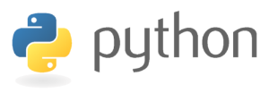

Python诞生于20世纪90年代初，由荷兰人Guido van Rossum开发完成，是一款非常简洁易读的解释型脚本语言；擅长于科学计算与图形处理，传统的计算机视觉库[OpenCV](https://opencv.org/)、三维可视化库[VTK](https://www.vtk.org/)、医学图像处理库[ITK](https://itk.org/)都提供了Python调用接口，Python也原生提供了[NumPy](http://www.numpy.org/)、[SciPy](https://www.scipy.org/)、[matplotlib](https://matplotlib.org/)等强大的科学计算扩展库。Web开发方面，Python也提供有[Django](https://www.djangoproject.com/)、[Tornado](http://www.tornadoweb.org/en/stable/)两款常用的Web开发框架。总而言之，得益于强大的开源社区支持，Python已经成为一门功能丰富的胶水语言。



本文的示例代码基于目前最新的[Python 3.6.6](https://www.python.org/downloads/)版本，在简单介绍相关语法，以及[pip](https://pypi.org/project/pip/)、[virtualenv](https://virtualenv.pypa.io/en/stable/)等扩展库的使用之后，将会最终完成一个基于Django的在线图片相似度比较程序。本文涉及的代码和Markdown都已经上传至笔者的[Github](https://github.com/uinika/python-quick-guide)，需要的朋友可以直接进行克隆，如果有任何建议或发现缪误请提交issue。

<!-- more -->

## Hello World

Python运行环境安装非常方便，Windows操作系统下直接前往[Python官网](https://python.org)下载安装包（*注意添加环境变量*），使用Debian软件包格式的Linux操作系统可以通过如下命令安装：

```bash
➜  sudo apt install python3
```

笔者的Linux开发环境下，同时存在`Python 3.6.6`和`Python 2.7.15`两个版本，因此Z-shell命令行中运行`Hello World`程序时，需要显式输入`python3`，以指定操作系统打开`Python 3.6.6`运行环境。

```bash
➜  / python3
Python 3.6.6 (default, Apr  1 2018, 05:46:30) 
[GCC 7.3.0] on linux
Type "help", "copyright", "credits" or "license" for more information.
>>> print("Hello World!")
Hello World!
```

> 代码执行完毕后，可以通过按下`CTRL + D`或者输入`exit()`退出Python运行环境。

当然，也可以单独将`print("Hello World!")`保存到一个独立的`test.py`代码文件，然后在命令行当中直接开始运行。

```bash
➜  1-hello-world python3 test1.py
Hello World!
```

默认情况下，Python源代码是以`UTF-8`格式进行编码的，但可以通过向源文件头部添加如下声明来指定编码格式。

```py
# -*- coding: utf-8 -*-
```

可以在`.py`脚本文件的头部手动添加Python解释器的路径，从而在Linux系统可以方便的通过`./test1.py`执行该脚本，避免`python3 test1.py`写法的繁琐。

```
#!/usr/bin/python3
```

Python使用缩进来表示代码块，相同代码块的语句必须包含相同的缩进空格数。

```py
# -*- coding: utf-8 -*-
number = 2018
if number > 2020:
    print(number)
print(number)
```

代码将只会执行最后的`print`语句，运行结果如下：

```bash
➜  1-hello-world git:(master) ✗ python3 test2.py
2018
```

## 变量

Python是弱类型语言，因此声明变量时不需要指定数据类型，现在修改上一步的例子，声明一个`infomation`变量然后输出：

```py
infomation = "Hello World!"
print(infomation)
```

执行结果如下：

```bash
➜  2-Variable git:(master) ✗ python3 test1.py
Hello World!
```

相对C、Go、Java等强类型语言，Python的语法结构更为松散，但是变量的命名依然需要遵循以下规则：

1. 变量名只能包含字母、数字、下划线，但不能以数字开头，例如`infomation_1`是合法的变量声明，但是`1_infomation`则属于非法。
2. 变量名不能包含空格，不过可以使用下划线来分隔单词，例如``print_something``是合法的，但是`print something`属于非法。
3. 不能使用Python关键字、函数名称作为变量名，例如`lambda`、`yield`、`raise`、`def`、`nonlocal`、`elif`、`assert`、`except`、`pass`、`with`。
4. 建议使用小写字母作为变量名，并且谨慎使用小写字母`l`和大写字母`O`，因为两者很容易被代码阅读者混淆为数字`1`和`0`。
5. 变量命名尽量见文知意，避免过度的缩写，例如`person_name`明显比`person_n`更加易读。

熟悉了变量命名规则之后，进一步扩展上面的程序，对变量`infomation`重新进行赋值然后打印输出：

```py
infomation = "Hello World!"
print(infomation)

infomation = "Hello Hank!"
print(infomation)
```

执行后将会输出两次打印结果：

```bash
➜  2-Variable git:(master) ✗ python3 test2.py
Hello World!
Hello Hank!
```

**traceback**（*回溯,追踪*）是Python语法解析器提供给开发人员的代码错误提示信息，可以更加直观的定位错误发生的代码位置。

```bash
➜  2-Variable git:(master) ✗ python test3.py
Traceback (most recent call last):  File "test3.py", line 2, in <module>
    print(deom)NameError: name 'deom' is not defined
```

## 注释

python当中可以使用`#`声明一个**单行注释**。

```py
# Comment
print("使用井号的单行注释；")
```

或者使用`3`个单引号`'''`声明一个**多行注释**。

```py
'''
First Comment
Second Comment
'''
print("使用3个单引号声明的多行注释；")
```

也可以使用`3`个双引号`"""`声明一个**多行注释**。

```py
"""
First Comment
Second Comment
"""
print("使用3个双引号声明的多行注释；")
```

## 数据类型

Python是弱类型语言，使用前不需要专门声明，赋值之后变量即被创建。Python一共拥有5种标准的数据类型：**数值**（*Number*）、**字符串**（*String*）、**列表**[*List*]、**元组**（*Tuple*）、**字典**{*Dictionary*}。

Python这5种标准数据类型除了通过字面量方式声明之外，还可以通过构造函数`int()`、`float()`、`complex()`、`str()`、`list()`、`tuple()`、`dict()`进行声明。

Python当中除了这5种标准数据类型之外，还有二进制序列类型（`bytes`, `bytearray`, `memoryview`）、集合类型（`set`, `frozenset`）等衍生的数据类型，本文这里并不将其作为基本数据类型进行介绍，开发人员可以结合官方文档的[《internal-objects》](https://docs.python.org/3.6/library/stdtypes.html#internal-objects)章节按需进行查阅。

### 数值 Number

由于Python非常适合于科学计算用途，因此对于数值类型方面内容的讲解篇幅相对较大。Python的数值类型分为**整型**（*精度不限*）、**浮点类型**（*底层使用C语言的双精度浮点类型实现*）、**复数类型**（*包含实部和虚部*）三种，其中**布尔类型**是作为整型的子类型出现。

当前硬件设备对Python浮点数精度的相关支持信息，可以通过如下代码进行查看。

```py
import sys
print(sys.float_info)
```

上述代码在笔者的64位Linux系统上执行的结果如下：

```py
sys.float_info(max=1.7976931348623157e+308, max_exp=1024, max_10_exp=308, min=2.2250738585072014e-308, min_exp=-1021, min_10_exp=-307, dig=15, mant_dig=53, epsilon=2.220446049250313e-16, radix=2, rounds=1)
```

全部数值类型都支持的运算符：

| 操作 | 结果 | 示例 |
|:------|:-------|:-----|
| `x + y`  | `x`与`y`的和 | `3 + 2`，结果为`5`。 |
| `x - y`  | `x`与`y`的差 | `5 - 1`，结果为`4`。 |
| `x * y`  | `x`与`y`的乘积 | `3 * 9`，结果为`27`。 |
| `x ** y` | `x`的`y`幂次方 | `2 ** 3`，结果为`8`。 |
| `x / y`  | `x`和`y`的商 | `8 / 2`，结果为`4.0`。 |
| `x // y` | `x`和`y`的商取整 | `4 // 3`，结果为`1`。 |
| `x % y`  | `x`与`y`的余数 | `12 % 7`，结果为`5`。 |
| `-x`     | 取`x`的负数 | `-3`。 |
| `+x`     | 取`x`的正数，原值不会变化 | `+3`。 |

全部数值类型都支持的方法：

| 操作 | 结果 | 示例 |
|:------|:-------|:-----|
| `abs(x)`          | 取`x`的绝对值 | `abs(-32.3)`，结果为`32.3`。 |
| `int(x)`          | 取`x`的整型 | `int(3.84)`，结果为`3`。 |
| `float(x)`        | 取`x`的浮点类型 | `float(5)`，结果为`5.0`。 |
| `complex(re, im)` | 一个以`re`作为实部`im`（默认为`0`）作为虚部的实数 | `complex(2.02, 3.3)`，结果为`(2.02+3.3j)`。 |
| `c.conjugate()`   | 复数`c`的共轭复数 | `(complex(2.02, 3.3)).conjugate()`，结果为`(2.02-3.3j)`。 |
| `divmod(x, y)`    | 由`(x // y, x % y)`组成的值对 | `divmod(12, 7)`，结果为`(1, 5)`。 |
| `pow(x, y)`       | `x`的`y`幂次方，等效于`x ** y` | `pow(2, 3)`，结果为`8`。 |

整型的位操作：

| 操作 | 结果 | 示例 |
|:------|:-------|:-----|
| `x & y`  | 按位与 | `3 & 2`，结果为`2`。 |
| `x ｜ y`  | 按位或 | `3 ｜ 2`，结果为`3`。 |
| `x ^ y`  | 按位异或 | `3 ^ 2`，结果为`1`。 |
| `x << n` | 左移位 | `3 << 2`，结果为`12`。 |
| `x >> n` | 右移位 | `3 >> 2`，结果为`0`。 |
| `~x`     | 按位取反 | `~3`，结果为`-4`。 |

Python的Boolean值由`False`和`True`两个静态对象组成，其它对象参与布尔运算时，通常被认为是`True`（*除非重写其类定义当中的`__bool__()`方法并返回`False`，或者重写`__len__()`并返回`0`*），下列对象在布尔运算中被认为是`False`。

1. 被定义为`False`的等效常量：`None`、`False`。
2. 任意值为`0`的数值类型：`0`、`0.0`、`0j`、`Decimal(0)`、`Fraction(0, 1)`。
3. 空的序列或者集合：`''`、`()`、`[]`、`{}`、`set()`、`range(0)`。

> 包含布尔结果的Python内建函数总是返回`0`和`False`或者`1`和`True`。

特别需要注意的是：**布尔运算`or`和`and`总是返回其中一个操作数本身**，请参见下面的布尔运算符说明表：

| 操作 | 结果 | 示例 |
|:------|:-------|:-----|
| `x or y`  | 如果`x`为假，那么返回`y`，否则返回`x`        | `2 or 3`，结果为`3`。 |
| `x and y` | 如果`x`为假，那么返回`x`, 否则返回`y`        | `2 and 3`，结果为`2`。 |
| `not x`   | 如果`x`为假, 那么返回`True`, 否则返回`False` | `not 0`，结果为`True`。 |

Python拥有6个比较运算符，其各自的运算优先级相同，可以随意链式使用。例如：` x < y <= z `与`x < y and y <= z`等效。

| 操作符 | 结果 | 示例 |
|:------|:-------|:-----|
| `x < y`      | 严格小于 | `3 < 1`，结果为`False`。 |
| `x <= y`     | 小于或等于 | `4 <= 4`，结果为`True`。 |
| `x > y`      | 严格大于 | `12 > 33`，结果为`False`。 |
| `x >= y`     | 大于或等于 | `21 >= 19`，结果为`True`。 |
| `x == y`     | 等于 | `["A", "B"] == ["A", "B"]`，结果为`True`。 |
| `x != y`     | 不等于 | `21 != 21`，结果为`False`。 |
| `x is y`     | 对象引用地址的相等性判断 | `["A", "B"] is ["A", "B"]`结果为`False`。 |
| `x is not y` | 对象引用地址的相等性判断的结果取反 | `["A", "B"] is not ["A", "B"]`结果为`True`。 |

### 字符串 String

Python中的字符串是一个不可变的Unicode字符序列，可以保存在`str`对象或者字符串字面量当中。其中，字符串字面量可以通过如下3种方式书写：

单引号：`'allows embedded "double" quotes'`。
双引号：`"allows embedded 'single' quotes"`。
三引号：`'''Three single quotes'''`、`"""Three double quotes"""`。

> 三引号字符串可以书写到多行，并且所有的空格都将会完整的保存下来。

Python字符串同样可以通过`class str(object=b'', encoding='utf-8', errors='strict')`构造器进行创建。

```py
str("hello python!") == "hello python!" # True
```

Python字符串可以进行索引，字符串第1个字符的索引为`0`，子字符串可以使用分割符`:`来指定。

```py
hank = "uinika"
print(hank[0]) # 输出字符串'u'
print(hank[0:4])  # 输出字符串 'uini'
```

### 列表 List

列表List是一个可变的序列（*即可以对列表的每个数据项进行修改*），用于存储同类数据的集合，可以通过如下方式进行创建：

1. 使用方括号`[]`表达一个空的列表，例如`[]`；
2. 使用方括号`[]`并且使用逗号`,`分隔每项数据，例如：`[1, 2, 3]`；
3. 使用列表理解，例如`[x for x in iterable]`；
4. 使用`list()`或者`list(iterable)`构造器；

```py
'''定义列表'''
cars = ['FORD', 'HONDA', 'BMW']

print(cars) # 输出['FORD', 'HONDA', 'BMW']

'''修改列表'''
car[2] = 'BENZ';
print(cars) # 输出['FORD', 'HONDA', 'BENZ']

'''打印列表指定项'''
print(cars[1]) # 输出HONDA

'''在列表尾部添加新的项目'''
cars.append("BENTLEY")
print(cars) # 输出['FORD', 'HONDA', 'BENZ', 'BENTLEY']

'''返回一个列表的拷贝'''
print(cars[:]) # 输出['FORD', 'HONDA', 'BENZ', 'BENTLEY']

'''指定位置批量插入值'''
cars[1:2] = ['CHERY', 'BYD']
print(cars) # 输出['FORD', 'CHERY', 'BYD', 'BENZ', 'BENTLEY']

'''打印列表长度'''
print(len(cars)) # 输出5

'''清除列表'''
cars = []
print(cars) # 输出[]
```

可以使用`class range(stop)`或者`class range(start, stop[, step])`生成一系列数值，通常指定`for`循环的次数。

```py
for value in range(1, 5):
  print(value)
'''
1
2
3
4
'''
```

使用`list()`构造函数可以将`range()`生成的结果直接转换为列表。

```py
"""生成range"""
range_numbers = range(1, 6)
print(type(range_numbers)) # <class 'range'>

"""转换为list"""
list_numbers = list(range_numbers)
print(type(list_numbers)) # <class 'list'>
print(list_numbers) # [1, 2, 3, 4, 5]
```

### 元组 Tuple

元组（*[ˈtʌpəl]*）是不可修改的序列类型，即不能对其中的元素进行修改。

1. 使用圆括号`()`表达一个空的元组，例如`()`；
2. 向只拥有一个数据项的元组最后添加逗号，例如：`(1,)`
3. 使用逗号分隔不同的数据项，例如：`(1, 2, 3)`；
4. 使用列表理解，例如`[x for x in iterable]`；
5. 使用内建的`tuple()`或者`tuple(iterable)`构造函数；

```py
'''定义元组'''
companies = ("Google", "Facebook", "Microsoft")

'''访问元祖元素'''
print("Top 1 is", companies[0]) # Top 1 is Google

'''访问倒数第1个元祖元素'''
print("Countdown 1 is", companies[-1]) # Countdown 1 is Microsoft

'''截取元组前两个元素'''
print("Top 2 is", companies[0: 2]) # Top 2 is ('Google', 'Facebook')

'''拷贝元组'''
print("All companies is", companies[0:]) # print("All companies are", companies[0:])

'''获取元组元素的个数'''
print("Number of companies is", len(companies)) # Number of companies is 3

'''修改元祖是非法的'''
companies[1] = "Yahoo" # TypeError: 'tuple' object does not support item assignment

'''删除元祖中的元素也是非法的'''
del companies[1] # TypeError: 'tuple' object doesn't support item deletion

'''但是可以删除元组及其所属的变量，so，互联网泡沫来了...'''
del companies;
print("Oops, Internet bubble burst!", companies) # NameError: name 'companies' is not defined
```

元组都可以使用`+`和`*`进行运算，也可以组合或者复制，然后获得一个新的元组。

```py
(1, 2, 3, "A", "B") + (4, 5, 6, "C", "D") # 输出(1, 2, 3, 'A', 'B', 4, 5, 6, 'C', 'D')

("UFO,")*5 # 输出'UFO,UFO,UFO,UFO,UFO,'

"Media" in ("System", "Softawre", "Media") # 输出True

for index in (0,1,2,3,4,5): print(index);
"""
输出
0
1
2
3
4
5
"""
```

> 上面介绍的列表List，也可以进行类似操作。

### 字典 Dictionary

Python官方文档当中，将**列表**（*List*）和**元组**（*Tuple*）归纳为**序列类型**（*Sequence Types*），而将**字典**（* dict*）类型归为**映射类型**（*Mapping Types*）。Python中的字典类型是使用花括号`{}`包裹并通过逗号`,`分隔的`key-value`键值对，例如：`{"name": "hank", "age": 33}`。当然，同样也可以通过`class dict(**kwarg)`、`class dict(mapping, **kwarg)`、`class dict(iterable, **kwarg)`构造函数进行创建。

```py
'''定义字典'''
hank = { "name": "uinika", 33: 1985 }

'''访问字典'''
print(hank["name"], hank[33]) # uinika 1985

'''修改字典'''
hank[33]=2018
print(hank) # {'name': 'uinika', 33: 2018}

'''删除字典'''
del hank[33]
print(hank) # {'name': 'uinika'}

'''使用len()打印字典长度'''
print(len(hank)) # 1

'''使用str()输出字典字符串'''
string_hank = str(hank)
print(string_hank) # {'name': 'uinika'}

'''使用str()输出字典字符串'''
print(type(string_hank)) # <class 'str'>
```

字典的`key`值必须是不可变的，因此可以使用**数字**、**字符串**、**元组**作为键值。但是由于**列表**的元素是可变的，因此被不能作为字典的键值。

```py
'''打印一个使用元组作为key的字典元素'''
dictionary = {(1, 2, 3):('A', 'B', 'C'), "贰": "二", "叁": "三"}
dictionary[(1, 2, 3)] # ('A', 'B', 'C')
```

## 条件判断

Python的条件判断语句与其它类C语言相似，但是每个condition后面需要使用冒号`:`表示后面是满足条件后执行的语句块。需要注意的是，**Python语句块的划分是通过缩来完成的，相同缩进数量的语句构成一个语句块**。

```py
if condition1:
  block1
elif condition2:
  block2
else:
  block3
```

下面的代码是一个条件判断语句的例子，当`if`和`elif`判断的结果都为`False`时，最终打印`else`子句的结果。

```py
if False:
  print("Current condition is IF")
elif False:
  print("Current condition is ELIF")
else:
  print("Current condition is ELSE")

'''
Current condition is ELSE
'''
```

> Python当中没有`switch/case`语句。

## 循环

### while循环

Python中使用`while`循环时，需要特别注意与其它类C语言语法的不同，即语句后的**标识符`:`**与**代码块缩进**。

```py
index = 1

while index <= 100:
  print(index)  # 输出1~100的序数
  index+=1
```

> 注意了，Python是没有`do/while`循环的。

可以通过设置条件表达为`True`实现无限循环，请看下面的例子：

```py
while True:
  print("Thit is an infinite loop")
```

如果`while`循环体当中只拥有一条语句，可以将其与`while`关键字书写在同一行，因此上面无限循环的示例也可以写成下面这样：

```py
while True: print("Thit is an infinite loop")
```

Python的`while`循环拥有一个与其它类C语言截然不同的用法，即使用`while/else`语句在条件判断为`False`时执行`else`语句块当中的内容。

```py
index = 1

while index <= 100:
  print(index)
  index+=1
else:
  print("超过100啦！")
```

### for循环

Python的`for`语句可以用来对**列表**、**元组**、**字典**、**字符串**进行遍历操作。

```py
cars = ['FORD', 'HONDA', 'BMW']

for car in cars:
  print("输出结果：", car)

'''
输出结果： FORD
输出结果： HONDA
输出结果： BMW
'''

companies = ("Google", "Facebook", "Microsoft")

for company in companies:
  print("输出结果：", company)

'''
输出结果： Google
输出结果： Facebook
输出结果： Microsoft
'''

dictionaries = { "total": 10000, "limit": 50 }

for key, value in dictionaries.items(): # 字典的items()方法返回该字典的每个键值对
  print("输出key值：", key)
  print("输出value值：", value)

'''
输出key值： total
输出value值： 10000
输出key值： limit
输出value值： 50
'''

text = "Chengdu"

for character in text:
  print("输出结果：", character)

'''
输出结果： C
输出结果： h
输出结果： e
输出结果： n
输出结果： g
输出结果： d
输出结果： u
'''
```

`for`语句同样可以结合`else`一起使用，`for`循环完毕之后，就会执行`else`子句中的代码。

```py
string = "成都"

for liter in string:
  print(liter)
else:
  print("赵雷")

'''
成
都
赵雷
'''
```

### break与continue

在Python的循环语句当中，可以通过`break`强行跳出当前循环体。

```py
for number in [0, 1, 2, 3, 4, 5]:
  if number == 5:
    break
  print(number)

print("Game over!")

'''
0
1
2
3
4
Game over!
'''
```

也可以通过`continue`直接略过本次循环。

```py
for number in [0, 1, 2, 3, 4, 5]:
  if number == 3:
    print("Skip number 3!")
    continue
  print(number)

'''
0
1
2
Skip number 3!
4
5
'''
```

### pass

`pass`被执行的时候，并不进行任何操作，只起到一个语法占位符的作用。

```py
def demo(arg): pass # 定义一个不进行任何操作的函数

class Demo: pass    # 定义一个没有任何方法的类
```

可以通过定义一个只有`pass`语句的类，来实现类似C语言结构体的功能。

```py
class Engineer:
    pass

hank = Engineer()

hank.name = "uinika"
hank.age = "18"

print(hank.name + " is just only " + hank.age) # uinika is just only 18
```

## 函数

Python使用关键字`def`来定义函数，使用方式和声明规则与其它类C语言相似。

```py
'''定义函数'''
def demo(parameter):
  print('this is a' + parameter + '!')
  return 0

'''调用函数
demo("function")
```

同其它类C语言一样，Python中的变量也可以分为局部变量（*定义在函数内部*）和全局变量（*定义在函数外部*）。

```py
'''定义函数'''
test = '全局变量'
def demo():
    test = '局部变量'
    print(test) # 局部变量

'''调用函数'''
demo()
```

### 命名参数

调用Python函数时，可以向其传递命名参数，指定该参数值由哪个函数参数进行接收，避免按照顺序接收所可能带来的潜在错误。

```py
def function(parameter): 
  print("parameter", parameter)

'''传递命名参数'''
function(parameter = 0) # parameter 0
```

### 默认参数

定义Python函数的时候，对于缺省的参数可以赋予其一个默认值。

```py
'''
定义函数的时候声明了parameter2的默认参数
'''
def function(parameter1, parameter2 = 2): 
  print("执行结果：")
  print("parameter1", parameter1)
  print("parameter2", parameter2)
)

function(parameter1 = 1)

'''
执行结果：
parameter1： 1
parameter2： 2
'''
```

### 可变参数列表

定义函数时，可以使用星号`*`作为前缀来声明一个可变参数列表，用来接收调用函数时传递的任意个数参数，这些参数会被包装至一个**元组**。

```py
# 在可变参数之前，可以放置任意数量的普通参数
def demo(parameter, *tuple):
  print('Parameter is：', parameter)
  print('Tuple is：', tuple)

demo('Hello Python!', 1, 2, 3, '四', '五')

'''
Parameter is： Hello Python!
Tuple is： (1, 2, 3, '四', '五')
```

也可以使用`**`作为前缀来声明参数，此时这些参数会包装为一个**字典**。

```py
def demo(parameter, **dictionary):
  print("Parameter is", parameter)
  print("Dictionary is", dictionary)

demo("Hello World!", a=1, b=2, c=3)

'''
Parameter is Hello World!
Dictionary is {'a': 1, 'b': 2, 'c': 3}
'''
```

如果`*`号**单独**出现在函数参数当中，那么后续的参数则必须使用**命名参数**显式传入。

```PY
def demo(parameter1, *, parameter2, parameter3):
  print("Parameter1 is", parameter1)
  print("Parameter2 is", parameter2);
  print("Parameter3 is", parameter3);

demo(1, parameter2 = 2, parameter3 = 3)

'''
Parameter1 is 1
Parameter2 is 2
Parameter3 is 3
'''

demo(A, B, parameter3 = C)

'''
Traceback (most recent call last):
  File "test1.py", line 14, in <module>
    demo(A, B, parameter3 = C)
NameError: name 'A' is not defined
'''
```

### lambda函数

Python的lambda函数是只由一个Python表达式所组成的匿名的内联函数，其语法书写形式如下：

```py
lambda [parameters]: expression
```

lamdba函数的语法只能包含一条语句，例如：

```py
demo = lambda parameterA, parameterB: print(parameterA / parameterB)

demo(1985, 8)

'''
248.125
'''
```

### return语句

`return`语句用于退出函数并返回函数的执行结果值，具体用法如下代码所示：

```py
def demo(parameter1, parameter2):
  return parameter1 + parameter2

print(demo(83, 2))
```

当Python中的`return`语句没有返回值时，则默认返回值为`None`。

```py
def demo():
  return

print(demo())

'''
None
'''
```

> 不带参数值的`return`语句返回`None`。

## 作用域

Python当中仅`module`模块、`class`类、`def`或`lambda`函数会引入新作用域，`if/elif/else`、`try/except`、`for/while`等代码块并不会引入新作用域，即这些语句当中定义的变量在其外部也能访问。

```py
def function():
  STRING = "This is a String!"

print(text)

'''
Traceback (most recent call last):
  File "test1.py", line 4, in <module>
    print(text)
NameError: name 'text' is not defined
'''

def function():
  text = "This is a String!"
  print(text)

function()

'''
This is a String!
'''
```

### `global`关键字

使用`global`关键字声明的标识符将会引用至**全局变量**，在局部作用域中对其进行的修改操作都将会保留下来，就如同操作真正的全局变量一样。

```py
text = "全局变量"

def function():
  global text
  print(text) # 输出："全局变量"
  text = "局部变量"
  print(text) # 输出："局部变量"

function()

print(text) # 输出："局部变量"
```

### `nonlocal`关键字

使用`nonlocal`关键字声明的标识符将会引用至当前作用域外层的变量，在当前作用域对其进行的修改操作都将会保留，如同在真正的操作该作用域外层的变量一样。

```py
def outer():
    text = "外部变量"

    def inner():
      nonlocal text
      text = "内部变量"
      print(text) # 输出："内部变量"
    
    inner()

    print(text) # 输出："内部变量"

outer()
```

## 类

Python使用`class`关键字创建一个**类**，然后直接调用类名即其初始化方法就可以创建这个类的**实例**。类进行实例化时，会自动调用该类的初始化方法`__init__(self)`（*作用类似于Java当中的构造函数*）。

```py
# Dog类
class Dog:
  # 类属性
  age = ""
  # 初始化方法
  def __init__(self, age):
    self.age = age;
  # 类方法
  def run(self):
    print("I'm running!")

pet = Dog("1岁") # 实例化Dog类，并显式向初始化函数__init__传递参数

print(pet.age)

pet.run()

'''
1岁
I'm running!
'''
```

> 注意：类方法（*包括初始化方法*）中的`self`参数是不能省略的，该参数指向类的实例，而非类本身。当然，根据个人编码习惯，也可以将`self`置换为其它语言中更为常用的`this`进行命名。

### 继承

Python做为面向对象的语言，自然是支持继承的。需要继承一个类，只需要在定义子类时传入父类的名称即可，同时为了保证子类和父类都能够正确的实例化，子类的初始化方法需要显示调用父类的初始化方法。

```py
# 定义Dog父类
class Dog:
  age = ""

  def __init__(self, age):
    self.age = age;

  def run(self):
    print(self.age)


# 定义Puppy子类，并传入Dog父类
class Puppy(Dog):
  weight = ""

  def __init__(self, weight):
    Dog.__init__(self, "1岁") # 调用父类Dog的初始化方法
    self.weight = weight;

  def cute(self):
    print(self.weight)

pet = Puppy("10斤")

pet.run() # 调用父类Dog的方法
pet.cute() # 调用子类Puppy的方法

'''
1岁
10斤
'''
```

如同Java一样，Python也是可以实现多重继承的。多重继承时，为了保证继承树能够正确的进行实例化，需要在子类的初始化方法`__init__`内显式的调用父类们的初始化方法，并将子类的`self`属性传递过去。

```py
class A:
  attribute = "";
  def __init__(self):
    print("A")

class B:
  def __init__(self):
    print("B")

class C(A, B):
  def __init__(self):
    A.__init__(self) # 在子类初始化方法内调用父类A的初始化方法
    B.__init__(self) # 在子类初始化方法内调用父类B的初始化方法
    print("C")

demo = C()

'''
A 
B 
C 
'''
```

### 私有属性和方法

在类中声明属性和方法时添加两条下划线`__`，就可以将这个属性和方法声明为**私有**的。私有属性和方法只能在类中通过`self.__private`进行访问，而不能在类实例化后进行访问。

```py
class demo:
  __attribute = "私有属性"

  def __getAttribute(self):
    print(self.__attribute + "私有方法")
  
test = demo()
test.__attribute # AttributeError: 'demo' object has no attribute '__attribute'
test.__getAttribute() # AttributeError: 'demo' object has no attribute '__getAttribute'  
```

### 方法重写override

如果父类中定义的方法不能满足要求，那么可以考虑在子类中对父类的方法进行重写。

```py
class Parent:
  def method(self):
    print("输出：Parent")

class Child(Parent):
  def __init__(self):
    Parent.__init__(self)
  def method(self):
    print("输出：Child")

childInstance = Child()

childInstance.method() # 输出：Child
```

当然，也可以通过`super()`函数显式调用被子类重写了的父类方法。对于上面的例子，可以使用如下语句调用父类的`method()`方法。

```py
super(Child, childInstance).method() # 输出：Parent
```

### 迭代器

大家可能注意到许多容器对象能够使用`for`语句进行循环处理，就像下面代码这样：

```py
for element in [1, 2, 3]:
    print(element)

for element in (1, 2, 3):
    print(element)

for key in {'one':1, 'two':2}:
    print(key)

for char in "123":
    print(char)

for line in open("file.txt"):
    print(line, end='')
```

这样的处理方法简单明了，实质上`for`语句调用容器对象上的`iter()`方法，该方法返回一个迭代器对象，这个迭代器对象当中定义了一个`__next__()`方法用于操作容器对象的元素，当没有更多可供迭代的元素时，该方法将会抛出一个`StopIteration`异常通知`for`语句终止循环操作。这里你可以通过`next()`内置函数去调用`__next__()`方法，参见下面的例子：

```py
string = 'abc'

stringIterator = iter(string)
print(stringIterator) # 输出<str_iterator object at 0x00000000023F8898>

print(next(stringIterator)) # 输出a
print(next(stringIterator)) # 输出b
print(next(stringIterator)) # 输出c
print(next(stringIterator))

'''
输出
Traceback (most recent call last):
  File "test.py", line 9, in <module>
    print(next(stringIterator))
StopIteration
'''
```

定义一个`iter()`方法，该方法用`next()`方法返回一个对象。如果该类定义了`next()`，那么`iter()`就可以返回`self`。

```py
# 迭代器，用于反向循环一个序列
class Reverse:
  def __init__(self, data):
    self.data = data # 初始化函数传入的待处理数据
    self.index = len(data) # 待处理数据的长度

  def __iter__(self):
    return self # 返回对象实例本身

  def __next__(self):
    if self.index == 0:
      raise StopIteration
    self.index = self.index - 1 
    return self.data[self.index] # 从字符串尾部开始逐一返回字母

reverseUinika = Reverse('Hank')
iter(reverseUinika) # 生成迭代器对象

for char in reverseUinika: # 循环打印
  print(char)

'''
k
n
a
H
'''
```

### 生成器

生成器Generator是一个用于建立迭代器iterators的简单又强大的工具，其书写方式类似于函数，但是在返回数据的时候使用了`yield`语句。当生成器的`next()`每次被调用的时候，生成器会恢复到其离开的位置（*生成器能够记忆所有的数据和最后执行的语句位置*）。

```py
def reverse(data):
  for index in range(len(data) - 1, -1, -1):
    yield data[index] # 使用yield语句

for char in reverse("Hank"):
  print(char)

'''
k
n
a
H
'''
```

上述代码实现了之前迭代器示例相同的功能，生成器函数代码如此短小精悍的原因在于`iter()`和`next()`方法的创建以及`StopIteration`异常抛出都是自动进行的。另外生成器函数的局部变量和执行状态在每次调用都会被保存，这样比前面基于class的迭代器总是手动处理`self.index`和`self.data`更加便捷。

一些简单的生成器可以使用特殊语法书（*与列表解析相似，不过使用圆括号代替了*）书写为一种更加简捷的表达式，即**生成器表达式**。这种表达式常用于在闭包函数内使用生成器的情况，语法上比完整的生成器定义更紧凑，并且比同等的列表理解更加容易记忆。

```py
# 求平方和
sumOfSquares = sum(index * index for index in range(10)) 
print(sumOfSquares) # 285

# 求点积
a = [10, 20, 30]
b = [7, 5, 3]
dotProduct = sum(x*y for x,y in zip(a, b))
print(dotProduct) # 260
```

## 异常处理

与其它类C语言一样，Python通过`try...except`语句块提供了健全的错误和异常处理机制。首先，`try`和`except`当中的子句被执行，此时如果没有异常出现，`except`子句会被跳过，同时`try`语句块正常执行完成。如果`try`的子句当中发生了异常，则会中断剩下子句的执行流程，并跳转去执行`except`关键字后声明异常类型所对应的语句，完成后继续执行该`try`语句块后续的内容。如果对应的异常类型没有找到，该异常会被传递到`try`语句块之外，如果语句块外依然没有进行相应的处理，那么程序的执行流程会被中断 ，并且向控制台打印出异常信息。

```py
try:
  number = 1 % 0
except ZeroDivisionError as error:
  print(error)  # integer division or modulo by zero
```

当然，也可以在一个`except`子句中捕捉多个异常。

```py
except (RuntimeError, TypeError, NameError):
  pass
```

如果`except`子句中的**异常类**具有继承关系，则它们都将会被触发。

```py
# 继承Exception类
class ExceptionA(c):
  pass

class ExceptionB(ExceptionA):
  pass

class ExceptionC(ExceptionB):
  pass

# 循环A、B、C异常类并抛出异常
for exception in [ExceptionA, ExceptionB, ExceptionC]:
  try:
    raise exception() # 抛出异常
  except ExceptionC:
    print("ExceptionC")
  except ExceptionB:
    print("ExceptionB")
  except ExceptionA:
    print("ExceptionA")

'''
ExceptionA
ExceptionB
ExceptionC
'''
```

> 如果将上面代码中`except`子句的处理顺序颠倒一下，那么打印结果会变为`ExceptionA ExceptionB ExceptionC`，这是因为异常类A、B、C产生的异常全部都会被异常类A捕捉然后中断执行。

值得注意的是，最后一条`except`子句可以省略掉异常名称，从而可以补捉到全部的异常类型，虽然同样可以执行打印错误信息和抛出异常的操作，不过要十分小心的使用，因为它可能会掩盖掉真实发生的异常信息。

```py
try:
    raise Exception
except OSError:
    print("OSError错误")
except:
    print("匹配所有异常")
    raise

'''
匹配所有异常
Traceback (most recent call last):
  File "test.py", line 4, in <module>
    raise Exception
Exception
'''
```

`try…except…`异常处理语句还拥有一个`else…`子句，用来在`try`子句没有捕捉到异常时执行一些必要的代码（*如果`try…except…`时发生了异常，则`else…`子句中的异常将不会得到执行*）。

```py
try:
    normal = 888
except Exception:
    print("捕获异常！")
else:
    print("没有异常发生时总是会被执行！")  # 没有异常发生时总是会被执行！
```

可以在`raise`子句当中声明**异常的参数**，并在`except`当中通过`as`关键字进行实例化以后进行接收。

```py
try:
  raise Exception("This is an Exception!")
except Exception as exception:
  print(type(exception))  # <class 'Exception'>
  print(exception.args)  # ('This is an Exception!',)
  print(exception)  # This is an Exception!
```

> 由于`Exception`类里定义了`__str__()`方法，所以可以通过直接打印异常对象来获取异常参数。

Python的异常处理机制，不光能处理`try`子句当中发生的异常，还能够处理`try`中调用的函数内发生的异常。

```py
def division():
  x = 1 / 0

try:
  division()
except ZeroDivisionError as error:
  print(error)  # division by zero
```

`raise`子句当中所要抛出的异常类必须继承自`Exception`，当异常被触发的时候，该异常类会被自动实例化并将执行流程带入`except`子句。

```py
class MyError(Exception):
  def __init__(self):
    Exception.__init__(self)
    print("自定义异常类的构造方法被调用了！")

try:
  raise MyError # 等效于raise ValueError()
except MyError:
  print(MyError)

'''
自定义异常类的构造方法被调用了！
<class '__main__.MyError'>
'''
```

如果希望不对抛出的异常进行处理，那么可以选择在`except`子句内重新将这个异常抛出。

```py
try:
    raise NameError("发生了一些错误!")
except NameError as error:
    print(error)
    raise

'''
发生了一些错误!
Traceback (most recent call last):
  File "test1.py", line 2, in <module>
    raise NameError("发生了一些错误!")
NameError: 发生了一些错误!
'''
```

开发人员可以自定义异常类，这些自定义的异常类必须继承自内置的`Exception`类。自定义异常类通常只会定义几个用来描述异常的属性，从而保持类定义的简单明了。对于一个模块发生多个错误，可以通过建立一个异常类的继承树来进行体现，来看下面的例子：

```py
# 针对该模块的自定义异常基类
class Error(Exception):
    pass

# 定义一个输入错误异常，继承了Error基类
class InputError(Error):
  def __init__(self, expression, message):
    self.expression = expression  # 异常的输入表达式
    self.message = message  # 异常信息说明

# 定义试图完成一个不被允许的状态转换操作时所发生的异常，继承了Error基类
class TransitionError(Error):
  def __init__(self, previous, next, message):
    self.previous = previous # 转换开始时的状态
    self.next = next # 尝试建立一个新的状态
    self.message = message # 解释为什么这个转换不被允许的原因
```

> **Python异常的命名通常会以`"Error"`结尾，建议自定义异常时保持这样的惯例**。

`try`语句还拥有一个可以用来进行一些清除操作的`finally`子句，该子句无论不否发生异常都会被执行（*与else的最大不同点*），读者可以参考下面的例子：

```py
def divide(x, y):
    try:
        result = x / y
    except ZeroDivisionError:
        print("不能使用0作为除数！")
    else:
        print("除法的结果是：", result)
    finally:
        print("结束子句！")

divide(2, 1)
'''
除法的结果是： 2.0
结束子句！
'''

divide(2, 0)  # 不能使用0作为除数！ 结束子句！
'''
不能使用0作为除数！
结束子句！
'''

divide("2", "1")
'''
结束子句！
Traceback (most recent call last):
  File "test1.py", line 13, in <module>
    divide("2", "1")
  File "test1.py", line 3, in divide
    result = x / y
TypeError: unsupported operand type(s) for /: 'str' and 'str'
'''
```

## 模块管理

Python通过`import`关键字来引入其它模块，并且需要将其放置到代码的顶部。Python当中`.py`文件的名称就是模块的名称，模块的名称可以通过全局变量`__name__`进行访问（*如果该模块是python命令行直接执行的模块，则`__name__`属性的打印结果为`"__main__"`*）。

```py
# myModule.py
def test():
    print("这是" + __name__ + "模块里的测试方法！")
```

```py
# main.py
import myModule

myModule.test()
```

```py
# 打印结果
这是myModule模块里的测试方法！
```

每个模块都拥有自己的私有**符号表**（*Symbol Table，一种存储键值对的数据结构*），因为被引入的模块名称会被放置在引入模块的全局**全局符号表**当中，所以模块当中定义的函数能够以**全局符号表**的方式进行使用。因此，模块的作者可以放心的在模块中使用全局变量，而毋须担心与其它用户的变量发生冲突。另一方面，如要需要访问这些模块里定义的全局变量 ，那么可以通过`module_name.variable_name`的方式进行访问。

如果觉得`module_name.variable_name`方式过于繁琐，那么可以通过`from module_name import iitem_name_in_module`语句指定从模块导入的内容，而无须总是在使用的时候添加模块的名称，请见下面的例子：

```py
# module.py
def demo1():
  print("This is demo1!")

def demo2():
  print("This is demo2!")
```

```py
# main.py
from module import demo1, demo2

demo1()
demo2()

'''
This is demo1!
This is demo2!
'''
```

当然，如果觉得比较麻烦，还可以使用`from module import *`一次性导入`module`模块当中的内容。但是需要注意的是这样并不能导入模块中以下划线`_`作为前缀的内容，比如下面这样：

```py
# module.py
def _privateDemo():
  print("This is a private demo!")
```

```py
from module import *

_privateDemo()

'''
Traceback (most recent call last):
  File "main.py", line 1, in <module>
    from module import privateDemo
ImportError: cannot import name 'privateDemo'
'''
```

> 这种一忺导入全部模块内容的方式在Python官方文档中是不被鼓励的，因此在现实开发场景下需要酌情使用。

如果引入模块的名称与当前模块定义的变量或者函数有冲突，那么可以考虑通过`as`关键字使模块中的内容绑定到一个别名上。

```py
# module.py
def demo():
  print("This is another demo!")
```

```py
# main.py
import module as m

m.demo()

'''
This is another demo!
'''
```

当然，也可以将`from...import...as...`结合起来使用，这样做会让代码更加简化。

```py
# main.py
from module import demo as d

d()

'''
This is another demo!
'''
```

出于性能方面的考量，一个模块只会在Python的每个解释器会话当中被引入一次，所以如果开发人员在解释器运行之后修改了模块的代码，则必须重新启动解释器。当然，如果你只有一个模块需要进行交互式的测试，则可以使用` importlib.reload()`方法暂时解决这个问题。

```py
import module
import importlib

importlib.reload(module)
```

### 以脚本方式执行模块

当在控制台直接执行Python脚本文件的时候，模块的`__name__`属性值会被设置为`"__main__"`，可以利用这个特性在模块文件在命令行以`python module.py`直接进行执行的时候，进行一些特定的交互和操作。

```py
# module.py
if __name__ == "__main__":
    import sys
    parameter = sys.argv[1]
    print(parameter)
```

```bash
➜  git:(master) ✗ python3 main.py 2018
2018
```

### 模块的搜索的路径

当一个模块名字被引入时，Python解释器会首先搜索内置模块是否存在该名称，如果不存在，则会按照`sys.path`属性的顺序进行搜索。即首先是当前`.py`脚本所在的目录，然后是Python环境变量相关的目录，最后进行Python安装相关的目录。

```py
import sys
print(sys.path)

'''
['/workspace/python-quick-guide/module', '/usr/lib/python36.zip', '/usr/lib/python3.6', '/usr/lib/python3.6/lib-dynload', '/home/hank/.local/lib/python3.6/site-packages', '/usr/local/lib/python3.6/dist-packages', '/usr/lib/python3/dist-packages']
'''
```

### 预编译

为了加快模块的加载速度，Pytho缓存了`__pycache__`目录下每个模块的编译版本至`module.version.pyc`名称下，例如**CPython release 3.6**里的`main.py`模块将会被缓存为`__pycache__/main.cpython-36.pyc`，这样的命名约定可以使不同Python版本的编译模块能够同时共存。

Python根据编译版本检查源代码的修改日期，以确定它是否过期，是否需要重新编译。这是一个完全自动的过程。此外，编译后的模块是独立于平台的，因此相同的库可以在具有不同体系结构的系统之间共享。

Python在两种情况下不检查缓存。首先，它总是重新编译，不存储直接从命令行加载的模块的结果。其次，如果没有源模块，它不会检查缓存。要支持非源(仅编译)发行版，编译后的模块必须位于源目录中，并且不允许有源模块。

Python在两种情况下不会检查缓存。首先，从命令行直接加载的模块总是会重新进行编译；其次，如果当前没有源模块时就不会检查缓存。为了支持非源（*仅编译可用*）的发行版，被编译的模块必须位于源目录，并且它们必须不能是一个源模块。

需要提醒一些资深的使用者：

- 你可以使用`-O`或`-OO`控制Python命令编译模块的尺寸，参数`-O`会移除assert语句，`-OO`会移除assert语句和`__doc__`字符串。由于有些程序可能依赖于这些选项，所以只有在知道自己在做什么时才应该使用这此选项。经过优化的模块会拥有一个`opt-`标识并且通常情况下尺寸会更小。但是未来的Python版本可能会调整这些优化的效果。
- 从`.pyc`文件读取的程序并不会比从`.py`文件读取的运行速度更快，`.pyc文件`唯一提高的是加载速度。
- 模块`compileall`能够为一个目录下的所有模块建立`.pyc`文件。

> Python内置的标准模块，有些是依赖于操作系统底层实现的，例如`winreg`模块只供在Windows系统上使用。但是模块`sys`比较特殊，它可以用于几乎所有平台的Python解释器。

### `dir()`方法

Python内置的`dir()`方法能够以字符串格式输出模块当中所定义的内容。

```py
# module.py
variable = 2018

def demo():
    print("This is a demo!")
```

```py
# main.py
import sys, module

print("main.py里的属性与方法：", dir()) # 打印当前模块内容
print("module.py里的属性与方法：", dir(module)) # 打印指定模块内容
```

```bash
main.py里的属性与方法： ['__annotations__', '__builtins__', '__cached__', '__doc__', '__file__', '__loader__', '__name__', '__package__', '__spec__', 'module', 'sys']
module.py里的属性与方法： ['__builtins__', '__cached__', '__doc__', '__file__', '__loader__', '__name__', '__package__', '__spec__', 'demo', 'variable']
```

可以通过向`dir()`方法传递内置的标准模块`builtins`来获取Python内建的函数和变量。

```py
import builtins

print(dir(builtins))
```

```bash
['ArithmeticError', 'AssertionError', 'AttributeError', 'BaseException', 'BlockingIOError', 'BrokenPipeError', 'BufferError', 'BytesWarning', 'ChildProcessError', 'ConnectionAbortedError', 'ConnectionError', 'ConnectionRefusedError', 'ConnectionResetError', 'DeprecationWarning', 'EOFError', 'Ellipsis', 'EnvironmentError', 'Exception', 'False', 'FileExistsError', 'FileNotFoundError', 'FloatingPointError', 'FutureWarning', 'GeneratorExit', 'IOError', 'ImportError', 'ImportWarning', 'IndentationError', 'IndexError', 'InterruptedError', 'IsADirectoryError', 'KeyError', 'KeyboardInterrupt', 'LookupError', 'MemoryError', 'ModuleNotFoundError', 'NameError', 'None', 'NotADirectoryError', 'NotImplemented', 'NotImplementedError', 'OSError', 'OverflowError', 'PendingDeprecationWarning', 'PermissionError', 'ProcessLookupError', 'RecursionError', 'ReferenceError', 'ResourceWarning', 'RuntimeError', 'RuntimeWarning', 'StopAsyncIteration', 'StopIteration', 'SyntaxError', 'SyntaxWarning', 'SystemError', 'SystemExit', 'TabError', 'TimeoutError', 'True', 'TypeError', 'UnboundLocalError', 'UnicodeDecodeError', 'UnicodeEncodeError', 'UnicodeError', 'UnicodeTranslateError', 'UnicodeWarning', 'UserWarning', 'ValueError', 'Warning', 'ZeroDivisionError', '__build_class__', '__debug__', '__doc__', '__import__', '__loader__', '__name__', '__package__', '__spec__', 'abs', 'all', 'any', 'ascii', 'bin', 'bool', 'bytearray', 'bytes', 'callable', 'chr', 'classmethod', 'compile', 'complex', 'copyright', 'credits', 'delattr', 'dict', 'dir', 'divmod', 'enumerate', 'eval', 'exec', 'exit', 'filter', 'float', 'format', 'frozenset', 'getattr', 'globals', 'hasattr', 'hash', 'help', 'hex', 'id', 'input', 'int', 'isinstance', 'issubclass', 'iter', 'len', 'license', 'list', 'locals', 'map', 'max', 'memoryview', 'min', 'next', 'object', 'oct', 'open', 'ord', 'pow', 'print', 'property', 'quit', 'range', 'repr', 'reversed', 'round', 'set', 'setattr', 'slice', 'sorted', 'staticmethod', 'str', 'sum', 'super', 'tuple', 'type', 'vars', 'zip']
```

### 包

Python将多个模块的集合称为**包**，包通过带点的模块名来构建Python的命名空间，例如模块名`A.B`表示在`A`包下建立的`B`子模块。

```py
# ./directory/module.py
def demo():
    print("This is a demo!")
```

```py
# main.py
import directory.module

directory.module.demo()
```

```py
# main.py
from directory.module import demo

demo()
```

注意，当使用`from package import item`格式语法的时候，`item`可以是一个子模块、子包、或者是定义在包中的函数、类、变量。这种情况下`import`语句首先会测试`item`是否定义在包中，如果没有则会被认为是一个模块，并且尝试去加载它。如果加载出现问题，则会抛出一个`ImportError`异常。

相反，使用`import item.subitem.subsubitem`格式语句的时候，除最后一个`item`以外每个`item`都必须是包，最后一个项目可以是模块或者包，但不能是前一个`item`中定义的类、函数、变量。

#### `from ... import *`

如果需要引入一个包下的所有子模块，必须显式的提供一个包的索引。如果一个包的`__init__.py`代码里定义了一个名为`__all__`的列表，它将被视为将要被`from package import *`引入的模块名称的列表。例如，对于一个`package`目录内的`__init__.py`文件可能包含如下内容：

```py
__all__ = ["echo", "surround", "reverse"]
```

上面意味着`from package import *`将会引入`package`目录下的`echo`、`surround`、`reverse`3个子模块。如果这里的`__all__`属性没有被定义，则`from package import *`语句就不会将子模块引入当前的命名空间，它只会确保`package`包被引入，并且也会执行`__init__.py`中的其它代码，然后引入包内定义的各种名称（*包括由`__init__.py`以及子模块定义的*）。


#### 通过相对路径引用包

Python当中，`from...import...`同样可以通过**相对路径**访问包。

```py
from . import package
from .. import package
from ..package import module
```

> 注意：相对路径的`import`是基于当前模块名称的，由于主模块名称总是`"__main__"`，所以用于作为Python应用程序的主模块必须始终使用绝对导入。

#### 处理多个目录中的包

Python中的包支持一个特殊的属性`__path__`，它可以被初始化成一个包含目录名称的列表，这个列表可以在该代码文件执行之前处理包的`__init__.py`。这个变量可以修改的，这样做会影响将来对包中包含的模块和子包的搜索。

> 虽然通常不需要这个特性，但是可以通过它来扩展包中的模块集合。


## 虚拟环境

虚拟环境（*Virtual Environment*）是一个自包含的目录树，用来管理Python第3方包依赖。不同的Python项目可以使用不同的虚拟环境，例如：应用程序`A`可以安装自己的`1.0`版本的虚拟环境，而应用程序`B`具有另一个`2.0`版本的虚拟环境，如果应用程序`B`需要将依赖库升级至`3.0`版本，这并不会影响应用程序`B`的虚拟环境。

Python官方提供了一个虚拟环境的轻量级实现模块[venv](https://docs.python.org/3.6/library/venv.html#module-venv)，较新版本的Python发行包里已经默认内置了其实现，可以直接进行使用。

```
python3 -m venv my-project
```

上面的语句执行之后，将会建立一个`my-project`目录，里面包含一个Python解释器的拷贝，以及相关的第3方依赖库，在Python3.6.6下执行得到的目录结构如下：


当建立完成项目的虚拟环境之后，可以通过如下命令进行激活：

```bash
# On Windows
my-project\Scripts\activate.bat

# On Unix or MacOS
source my-project/bin/activate
```

激活后将会改变当前Shell的显示信息，以提示开发人员当前正在使用的是哪个虚拟环境。

```bash
➜  /workspace source my-project/bin/activate
(my-project) ➜  /workspace python
Python 3.6.6 (default, Sep 12 2018, 18:26:19) 
[GCC 8.0.1 20180414 (experimental) [trunk revision 259383]] on linux
Type "help", "copyright", "credits" or "license" for more information.
>>> import sys
>>> sys.path
['', '/usr/lib/python36.zip', '/usr/lib/python3.6', '/usr/lib/python3.6/lib-dynload', '/workspace/my-project/lib/python3.6/site-packages']
```

> [virtualenv](https://virtualenv.pypa.io/en/latest/)是一个第3方社区提供的独立Python虚拟环境，同时支持Python2和Python3版本。在Python3.3以后，官方提供了上述的`venv`模块原生支持虚拟环境，因此`virtualenv`逐步废弃使用。

## 包管理

Python可以使用应用程序`pip`安装、升级、移除第三方依赖包，正常情况下`pip`已经伴随Python解释器默认安装。

```bash
# 搜索包
(my-project) ➜  /workspace pip search djongo
djongo (1.2.30)  - Driver for allowing Django to use MongoDB as the database backend.

# 安装包
(my-project) ➜  /workspace pip install djongo
Collecting djongo
  Downloading https://files.pythonhosted.org/packages/92/07/d4943617a9ac3a331a41717b54db7736ee2106f59f6726efac4f9614ea44/djongo-1.2.30-py3-none-any.whl
Collecting pymongo>=3.2.0 (from djongo)
  Downloading https://files.pythonhosted.org/packages/b1/45/5440555b901a8416196fbf2499c4678ef74de8080c007104107a8cfdda20/pymongo-3.7.2-cp36-cp36m-manylinux1_x86_64.whl (408kB)
    100% |████████████████████████████████| 409kB 406kB/s 
Collecting dataclasses>=0.1 (from djongo)
  Downloading https://files.pythonhosted.org/packages/26/2f/1095cdc2868052dd1e64520f7c0d5c8c550ad297e944e641dbf1ffbb9a5d/dataclasses-0.6-py3-none-any.whl
Collecting django>=2.0 (from djongo)
  Downloading https://files.pythonhosted.org/packages/32/ab/22530cc1b2114e6067eece94a333d6c749fa1c56a009f0721e51c181ea53/Django-2.1.2-py3-none-any.whl (7.3MB)
    100% |████████████████████████████████| 7.3MB 141kB/s 
Collecting sqlparse>=0.2.3 (from djongo)
  Downloading https://files.pythonhosted.org/packages/65/85/20bdd72f4537cf2c4d5d005368d502b2f464ede22982e724a82c86268eda/sqlparse-0.2.4-py2.py3-none-any.whl
Collecting pytz (from django>=2.0->djongo)
  Downloading https://files.pythonhosted.org/packages/52/8b/876c5745f617630be90cfb8fafe363c6d7204b176dc707d1805d1e9a0a35/pytz-2018.6-py2.py3-none-any.whl (507kB)
    100% |████████████████████████████████| 512kB 678kB/s 
Installing collected packages: pymongo, dataclasses, pytz, django, sqlparse, djongo
Successfully installed dataclasses-0.6 django-2.1.2 djongo-1.2.30 pymongo-3.7.2 pytz-2018.6 sqlparse-0.2.4

# 移除包
(my-project) ➜  /workspace pip uninstall djongo
Uninstalling djongo-1.2.30:
  /workspace/my-project/lib/python3.6/site-packages/djongo-1.2.30.dist-info/INSTALLER
  /workspace/my-project/lib/python3.6/site-packages/djongo-1.2.30.dist-info/METADATA
  /workspace/my-project/lib/python3.6/site-packages/djongo-1.2.30.dist-info/RECORD
  /workspace/my-project/lib/python3.6/site-packages/djongo-1.2.30.dist-info/WHEEL
  /workspace/my-project/lib/python3.6/site-packages/djongo-1.2.30.dist-info/top_level.txt
  /workspace/my-project/lib/python3.6/site-packages/djongo/__init__.py

# 安装包的指定版本
(my-project) ➜  my-project pip install Django==2.1.2
Collecting Django==2.1.2
  Using cached https://files.pythonhosted.org/packages/32/ab/22530cc1b2114e6067eece94a333d6c749fa1c56a009f0721e51c181ea53/Django-2.1.2-py3-none-any.whl
Requirement already satisfied: pytz in ./lib/python3.6/site-packages (from Django==2.1.2)
Installing collected packages: Django
Successfully installed Django-2.1.2

# 升级指定包的版本
(my-project) ➜  my-project pip install --upgrade djongo
Collecting djongo
  Using cached https://files.pythonhosted.org/packages/92/07/d4943617a9ac3a331a41717b54db7736ee2106f59f6726efac4f9614ea44/djongo-1.2.30-py3-none-any.whl
Requirement already up-to-date: django>=2.0 in ./lib/python3.6/site-packages (from djongo)
Requirement already up-to-date: pymongo>=3.2.0 in ./lib/python3.6/site-packages (from djongo)
Requirement already up-to-date: sqlparse>=0.2.3 in ./lib/python3.6/site-packages (from djongo)
Requirement already up-to-date: dataclasses>=0.1 in ./lib/python3.6/site-packages (from djongo)
Requirement already up-to-date: pytz in ./lib/python3.6/site-packages (from django>=2.0->djongo)
Installing collected packages: djongo
Successfully installed djongo-1.2.30

# 查看包的指定信息
(my-project) ➜  my-project pip show djongo
Name: djongo
Version: 1.2.30
Summary: Driver for allowing Django to use MongoDB as the database backend.
Home-page: https://nesdis.github.io/djongo/
Author: nesdis
Author-email: nesdis@gmail.com
License: BSD
Location: /workspace/my-project/lib/python3.6/site-packages
Requires: sqlparse, dataclasses, django, pymongo

# 展示当前虚拟环境下安装的包
(my-project) ➜  my-project pip list
DEPRECATION: The default format will switch to columns in the future. You can use --format=(legacy|columns) (or define a format=(legacy|columns) in your pip.conf under the [list] section) to disable this warning.
dataclasses (0.6)
Django (2.1.2)
djongo (1.2.30)
pip (9.0.1)
pkg-resources (0.0.0)
pymongo (3.7.2)
pytz (2018.6)
setuptools (39.0.1)
sqlparse (0.2.4)
```

`pip freeze`将会生成已安装的包列表，但输出格式使用了`pip install`所期望的格式，通常Python约定将该列表放置到一个`requirements.txt`文件。

```bash
(my-project) ➜  my-project pip freeze > requirements.txt

# requirements.txt
dataclasses==0.6
Django==2.1.2
djongo==1.2.30
pkg-resources==0.0.0
pymongo==3.7.2
pytz==2018.6
sqlparse==0.2.4
```

然后可以将`requirements.txt`文件伴随应用程序一起提交至版本管理系统当中，然后其它用户可以在同步代码之后使用`pip install -r requirements.txt`安装所需的包。

```bash
(my-project) ➜  my-project pip install -r requirements.txt 
Requirement already satisfied: dataclasses==0.6 in ./lib/python3.6/site-packages (from -r requirements.txt (line 1))
Requirement already satisfied: Django==2.1.2 in ./lib/python3.6/site-packages (from -r requirements.txt (line 2))
Requirement already satisfied: djongo==1.2.30 in ./lib/python3.6/site-packages (from -r requirements.txt (line 3))
Requirement already satisfied: pkg-resources==0.0.0 in ./lib/python3.6/site-packages (from -r requirements.txt (line 4))
Requirement already satisfied: pymongo==3.7.2 in ./lib/python3.6/site-packages (from -r requirements.txt (line 5))
Requirement already satisfied: pytz==2018.6 in ./lib/python3.6/site-packages (from -r requirements.txt (line 6))
Requirement already satisfied: sqlparse==0.2.4 in ./lib/python3.6/site-packages (from -r requirements.txt (line 7))
```


## 输入输出

Python内置了许多方法去完成输入输出操作，这些方法能够将数据以人类可读的形式打印出来，也可以将其写入文件当中供将来使用。

### 输出格式化

Python提供了两种字符串格式化输出的方法，一种是使用`format()`函数进行格式化输出，另一种是通过`print()`函数的格式化占位符完成。

```py
print("{}是中国的一个{}".format("成都", "省"))
print("{0}是中国的一个{1}".format("成都", "省"))
print("{city}是中国的一个{province}".format(city="成都", province="省"))

'''
成都是中国的一个省
成都是中国的一个省
成都是中国的一个省
'''
```

```py
print("%s是中国的一个%s" % ("成都","省"))
print("%(city)s是中国的一个%(province)s" % {"city": "成都", "province": "省"})

'''
成都是中国的一个省
成都是中国的一个省
'''
```

Python当中可以使用`str()`和`repr()`方法将任意值转换成为字符串。其中`str()`会返回人类可读的字符串，`repr()`则会生成Python解释器能够读取的格式。

```py
string = str("Hank\n");
represent = repr("Hank\n");

print(string)
print(represent)

'''
Hank

'Hank\n'
'''
```

### 文件读写

Python当中`open(filename, mode, encoding)`函数会返回一个`file`对象，其中`filename`是需要打开的文件名，`mode`用于标识以何种方式打开文件，`encoding`指定读写操作的编码格式。

| 模式 | 意义 |
|:-----|:-----|
| `"r"` | 以读方式打开（*默认*）。 |
| `"w"` | 以写方式打开，并清除之前内容。 |
| `"x"` | 创建文件，如果文件已经存在则操作失败。 |
| `"a"` | 以写方式打开，并在之前内容的尾部追加新内容。 |
| `"b"` | 二进制模式。 |
| `"t"` | 文本模式（*默认*）。 |
| `"+"` | 打开一个磁盘文件进行读写操作。 |
| `"U"` | 通用换行模式（*已废弃*）。 |

使用`file`对象的最佳实践是与`with`关键字结合在一起，从而保证`file`对象总是能在恰当的时间关闭，即使出现异常，使用`with`关键字也比书写等效的`try-finally`简洁，这个在接下来的[对象清理](#对象清理)章节有更详细的讲解。

```py
with open("demo.txt", mode = "r", encoding="utf8") as file:
  readData = file.read()
  print(readData)

file.close()

'''
和我在成都的街头走一走 喔哦
直到所有的灯都熄灭了也不停留
'''
```

如果`file`对象已经被`with`关键字或者`close()`方法关闭，后续任何对`file`对象的操作都将会失败，比如下面的例子：

```py
file.close()
file.read()

'''
Traceback (most recent call last):
  File "demo.py", line 6, in <module>
    file.read()
ValueError: I/O operation on closed file.
'''
```

使用`readline()`方法可以每次只读取一行数据。

```py
with open("demo.txt", mode = "r", encoding="utf8") as file:
  readData = file.readline() # 只读取一行数据
  print(readData)

'''
和我在成都的街头走一走 喔哦
'''
```

当然，也可以通过循环`file`对象来读取目标文件中的每行数据。

```py
with open("demo.txt", mode = "r", encoding="utf8") as file:
  for line in file:
    print(line)

'''
和我在成都的街头走一走 喔哦

直到所有的灯都熄灭了也不停留
'''
```

> 如果需要读取指定文件的全部内容，还可以采用`list(file)`或`file.readlines()`方法。

`write(string)`用于写入字符串内容到文件，并返回写入的字符数量。

```py
with open("demo.txt", mode = "w", encoding="utf8") as file:
  print(file.write("Hank"))

'''
4
'''
```

### 对象清理

Python当中的一些预定义对象会内置清理行为，可以在对象不再需要的时候被自动执行。

```py
for line in open("myfile.txt"):
    print(line, end="")
```

上面这段代码的问题在于，代码执行完后没有立即关闭打开的文件。这在相对简单的脚本代码中不算问题，但对于更大规模的应用而言就是严重的错误。因此，Python提供了`with`语句来确保`file`这样的对象在使用后能够被正确的清理和关闭。

```py
with open("myfile.txt") as file:
    for line in file:
        print(line, end="")
```

上面语句执行之后，即使读取文件数据时出现问题，`file`对象也能正常关闭，因为`file`对象已经预定义了相关清除行为。


## Python之禅

可以在Python命令行模式输入`import this`得到一份关于Python的优秀指导原则**《Python之禅》**。

- 优美胜于丑陋。
- 明了胜于晦涩。
- 简洁胜于复杂。
- 复杂胜于凌乱。
- 扁平胜于嵌套。
- 间隔胜于紧凑。
- 保持良好可读性。
- 即便是特例也不可打压破这些规则。
- 实用性胜过纯粹性。
- 对错误与异常不能保持沉默，除非你刻意需要这样做。
- 面对模棱两可拒绝猜测，应该寻找最好的一个解决方案。
- 虽然动手做好过于什么都不做，但是仔细思考以后再动手胜过于盲目的去做。
- 如果实现难以解释，这必然是一个坏主意。
- 如果实现易于解释，这可能是一个好主意。
- 命名空间是非常好的主意，要善于进行利用。

### 使用JSON保存结构化数据

JSON可以用来保存诸如嵌套的字典或者列表这样的结构化数据，Python提供了`json`模块来处理JSON格式数据，具体使用方法请参见下面的示例代码：

```py
import json

string = json.dumps([28, "Hank"])
print(string) # [28, "Hank"]
```

也可以在打开文件之后，将文件内容序列化为JSON格式。

```py
import json

with open("test.json", mode = "r", encoding="utf8") as file:
  string = json.load(file)
  print(string) # {'user': 'Hank', 'age': 33}
```


## 实践：使用Djongo搭建Web服务


## 实践：在线图片相似度比较